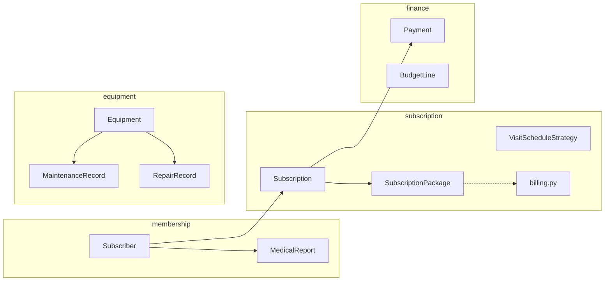

# Gym management information system — full project context (AI & team)

This document is the **single source of context** for the **Topic 3** (BLM3722) application. When sharing with another LLM or teammate, attach this file (and `README.md` if needed); it is enough to produce **analysis, design, UML, and traceability** outputs expected in the course report.

**Quick links**

- Live API contract: while the server runs, `http://127.0.0.1:8000/openapi.json` or `/docs`
- Web UI: `http://127.0.0.1:8000/ui/`
- Source root: [`src/gym_management/`](../src/gym_management/)

---

## 1. How to use this document (for AI)

1. **Traceability matrix:** Copy the `FR-XX` rows from Section 5 into Excel / Violet notes; add columns for “analysis class / design class / diagram name”.  
2. **Use cases:** Section 6 lists each `UC-XX` with a short text; adapt into Violet use-case boxes.  
3. **Class diagram (analysis):** Combine Section 4 (domain), 7 (patterns), 8 (fields) into packages in Violet.  
4. **Class diagram (design):** Add repository protocols, `*Repository` adapters, API schemas, and optional route→use-case notes.  
5. **Sequence / Activity / State:** Sections 9–11 map scenarios to diagram types; derive message order from route and repo file names.  
6. **Assumptions:** Section 12 can be copied into the report “assumptions / constraints” section.

---

## 2. Project identity and technology

| Attribute | Value |
|-----------|--------|
| Topic | **Topic 3 — Gym management information system** (software engineering project) |
| Language / stack | Python 3.11+ |
| HTTP | **FastAPI** |
| Persistence | **SQLite** file `gym.db` (created in the **process working directory**, usually the project root) |
| ORM | SQLAlchemy 2.x |
| Web UI | Jinja2 templates + Chart.js (CDN) on the dashboard |
| Package name | `gym_management` ([`src/gym_management`](../src/gym_management)) |

**Architecture note:** Most business rules live in the **domain** layer. There is no separate **application service** layer; HTTP handlers ([`api/routes/`](../src/gym_management/api/routes/), [`web/ui_routes.py`](../src/gym_management/web/ui_routes.py)) call **repository** concrete classes directly. In a design report you may label conceptual `XYZService` boxes or describe the app as “Application = FastAPI endpoints” — both are defensible in a teaching context.

---

## 3. Course assignment — in repo vs in the written report

What the assignment text may ask for versus what this repo contains:

| Expected (typical) | In this repo | Team / report |
|--------------------|--------------|---------------|
| Project plan, Gantt, feasibility, team, risk | — | Report + tools outside Violet |
| Use-case model + diagram | Partially: UC catalogue below | Text + Violet |
| Traceability (class-level) | Partially: `FR-XX` based | Extend matrix for submission |
| Analysis (domain) class diagram | Class list + relations in text | Draw in Violet |
| Design class diagram (+ methods) | Code methods = design | Show on diagram |
| ≥1 sequence, activity, state | Suggestions in Sections 9–11 | Violet |
| ≥1 code module + optional platform | Full backend + web UI | — |
| ≥2 unit tests + output + author | `tests/` — 12+ tests (medical report, visit strategy, billing, budget sync) | Screenshot + student names |
| Stated assumptions | Section 12 | Copy into report |

---

## 4. Conceptual modules (UML package boxes)

Folder layout under `domain/` matches these names:

---

## 5. Traceability matrix (functional requirement → code)

Keep `FR` IDs stable in the report; extend the table as needed.

| ID | Requirement (summary) | Domain types | Repository / adapter | REST (JSON) | Web UI |
|----|----------------------|--------------|----------------------|-------------|--------|
| FR-01 | Multiple package types (2-day / 3-day / daily time window), price; **billing period** (monthly / multi-month) `billing_cycle_months` | `SubscriptionPackage`, `PackageKind`, `VisitScheduleStrategy`, `package_factory`, [`billing.py`](../src/gym_management/domain/subscription/billing.py) | `SqlSubscriptionPackageRepository` | `POST/GET /subscriptions/packages` | `/ui/packages` |
| FR-02 | Start subscription | `Subscription`, `SubscriptionStatus` | `SqlSubscriptionRepository` | `POST /subscriptions/memberships`, `GET .../by-subscriber/{id}` | `/ui/subscriptions` |
| FR-03 | Payments; **payment rolls into subscription-revenue budget for that calendar month** | `Payment` | `SqlPaymentRepository`; `SqlBudgetLineRepository.apply_subscription_payment_to_budget` | `POST/GET .../payments`, `GET .../total` | `/ui/subscriptions` (pay form) |
| FR-04 | Budget (planned vs actual) | `BudgetLine`, `BudgetCategory` | `SqlBudgetLineRepository` | `PUT/GET /subscriptions/budget/{y}/{m}` | `/ui/budget` |
| FR-05 | Member records | `Subscriber` | `SqlSubscriberRepository` | `POST/GET /membership/subscribers` | `/ui/members` (package column shows **active** subscriptions only) |
| FR-06 | Medical clearance; 1-year validity; queries | `MedicalReport` | `SqlMedicalReportRepository` | `POST /membership/medical-reports`, `GET .../expiring` | `/ui/members`, `members#raporlar`; dashboard shows expiries **between today and today + 30 days** (**already expired excluded**); members page holds full report lists and a longer “expiring / expired” table |
| FR-07 | In-gym maintenance + cost | `MaintenanceRecord` | `SqlMaintenanceRepository` | `POST/GET /equipment/{id}/maintenance` | `/ui/equipment` (compact rows, history/forms in `
`) |
| FR-08 | External repair + cost | `RepairRecord` | `SqlRepairRepository` | `POST/GET /equipment/{id}/repairs` | `/ui/equipment` |
| FR-09 | Period cost summary (maintenance vs repair) | — (aggregation) | `SqlMaintenanceRepository.total_cost_between`, `SqlRepairRepository.total_cost_between` | `GET /reports/costs` | `/ui/reports` |
| FR-10 | Dashboard (stats + charts) | — | Multiple repo calls | — | `/ui/` (Chart.js) |

**Automated tests (mapping):**

| ID | File / focus |
|----|----------------|
| T-01 | [`tests/test_medical_report.py`](../tests/test_medical_report.py) — validity, leap year |
| T-02 | [`tests/test_visit_schedule_strategy.py`](../tests/test_visit_schedule_strategy.py) — package rules, strategy validation |
| T-03 | [`tests/test_subscription_billing.py`](../tests/test_subscription_billing.py) — `billing_cycle_months`, period count, expected total |
| T-04 | [`tests/test_budget_payment_sync.py`](../tests/test_budget_payment_sync.py) — budget `actual` after payment |

---

## 6. Actors and use-case catalogue (text draft)

**Suggested actors:** `Staff` / `Manager`, `System`, optional `Member` (no member login in code; UCs may assume staff acts on behalf of members).

| UC ID | Name | Actor | Goal |
|-------|------|-------|------|
| UC-01 | Define package | Staff | Create membership product and price |
| UC-02 | Register member | Staff | Subscriber + optional report link |
| UC-03 | Record medical report | Staff | Clearance document and issue date |
| UC-04 | Query report expiry | Staff | List expired / soon-to-expire reports |
| UC-05 | Start subscription | Staff | Member + package |
| UC-06 | Record payment | Staff | Collect subscription payment |
| UC-07 | Update budget | Staff | Monthly planned vs actual |
| UC-08 | Register equipment | Staff | Inventory |
| UC-09 | Record maintenance | Staff | In-house work + cost |
| UC-10 | Record repair | Staff | Vendor repair + cost |
| UC-11 | View cost report | Staff | Maintenance/repair totals in a date range |

For each UC the report usually adds: **preconditions**, **main flow** (numbered steps), **alternatives** (e.g. invalid amount), **postconditions**. API/UI paths: Section 5.

---

## 7. Design patterns (for UML notes)

| Pattern | Intent | Location |
|---------|--------|----------|
| **Strategy** | Swappable “may visit on this day/time?” rule per package type | [`schedule_strategy.py`](../src/gym_management/domain/subscription/schedule_strategy.py) |
| **Factory** | Build package + wired strategy | [`package_factory.py`](../src/gym_management/domain/subscription/package_factory.py) |
| **Repository** | Isolate domain from persistence | [`repositories.py`](../src/gym_management/application/repositories.py), [`repo_sqlalchemy.py`](../src/gym_management/infrastructure/repo_sqlalchemy.py) |

**Pure helpers:** Billing-period math for revenue expectations — [`billing.py`](../src/gym_management/domain/subscription/billing.py) (`subscription_billing_period_count`, `subscription_expected_total`).

Optional report note: concrete `Sql*Repository` classes belong in an “Infrastructure” package on diagrams.

---

## 8. Domain classes — fields and behaviour

### `membership/`

- **`MedicalReport`**: `institution_name`, `issued_on`; `expires_on()`, `is_expired(as_of)`, `days_until_expiry(as_of)` — **one-year rule** is implemented here.
- **`Subscriber`**: `full_name`, `email`, `phone`, `medical_report_id` (optional FK).

### `subscription/`

- **`PackageKind`**: `fixed_two_days` | `fixed_three_days` | `daily_time_window`.
- **`SubscriptionPackage`**: `price_amount` is **per billing period**; `billing_cycle_months` (e.g. 1 = monthly, 3 = quarterly, 12 = yearly); `kind`, `allowed_weekdays`, time window; `allows_visit(weekday, time)` delegates to strategy.
- **`Subscription`**: `subscriber_id`, `package_id`, `start_date`, `end_date`, `status` (`SubscriptionStatus`).

### `finance/`

- **`Payment`**: `subscription_id`, `amount`, `paid_at`, `note`.
- **`BudgetLine`**: `period_year`, `period_month`, `category`, `planned_amount`, `actual_amount`.
- **`BudgetCategory`**: `subscription_revenue`, `maintenance_expense`, `repair_expense`.

### `equipment/`

- **`Equipment`**: `name`, `serial_number`, `status` (`EquipmentStatus`).
- **`MaintenanceRecord`**: `equipment_id`, `performed_on`, `cost_amount`, `description`.
- **`RepairRecord`**: `equipment_id`, `service_vendor`, `sent_on`, `returned_on`, `cost_amount`, `description`.

### Weekday encoding

**Weekdays** follow `datetime.weekday()`: **0 = Monday … 6 = Sunday** (stored for fixed-day packages).

---

## 9. Example message chains for sequence diagrams

**UC-06 Record payment (REST)**

1. `Client` → `FastAPI`: `POST /subscriptions/memberships/{id}/payments`
2. `Route handler` → `SqlSubscriptionRepository`: `get(subscription_id)` (validation)
3. `Route handler` → `SqlPaymentRepository`: `add(Payment)`
4. `SqlPaymentRepository` → `Session`: flush / commit (`get_db`)

**UC-05 Subscriptions (Web)**

1. `Browser` → `GET /ui/subscriptions`
2. `ui_routes.page_subscriptions` → multiple `Sql*Repository.list...`
3. `render_page` → Jinja template

In Violet: lifelines e.g. `Actor`, `Route`, `Repository`, `Database` (optional).

---

## 10. Good candidates for activity diagrams

- **New subscription + first payment:** Member exists? Package pick → create subscription → optional payment.  
- **Equipment repair:** Fault → send to vendor → optional return → cost record.  
- **Report renewal reminder:** Check expiry date → list / notify (narrative in report).

---

## 11. Good candidates for state diagrams

| Entity | States (enum / derived) | Note |
|--------|------------------------|------|
| `Subscription` | `active`, `expired`, `cancelled` | `SubscriptionStatus` |
| `Equipment` | `operational`, `maintenance`, `out_for_repair` | `EquipmentStatus` |
| `MedicalReport` (abstract) | `valid` / `expired` | Derived from dates; no dedicated enum |

If the assignment asks for **one** state diagram, **`Equipment`** or **`Subscription`** maps most directly.

---

## 12. Assumptions and constraints (for “acceptance & limitations” in the report)

1. **Single branch**; no multi-tenant / multi-location model.  
2. **TRY** only; no FX, tax, or invoice detail.  
3. **No authentication / roles**; API and UI assume one trusted operator.  
4. Packages are **pre-defined templates**; no per-member custom day-picker.  
5. Medical clearance: **issue date + one calendar year**; Feb 29 issues clamp to Feb 28 next year.  
6. Database: **SQLite only**, `gym.db` in the working directory.  
7. **Seed:** When the package catalog is empty, [`seed.py`](../src/gym_management/infrastructure/seed.py) loads sample data (members, monthly/multi-month packages, payments, equipment, budget). If you add ORM columns (e.g. `billing_cycle_months`), **delete `gym.db`** and restart (stop the server if the file is locked).  
8. Dashboard charts load **Chart.js** from a CDN. The medical-alert strip and equipment page may load **Google Fonts** from a CDN — offline demos would need local assets.  
9. Seed data avoids placeholder domains like `@demo.test`; sample emails use domains such as `sportifposta.com` / `posta.gen.tr`.

---

## 13. Persistence (tables) — summary

| Table | Main fields / notes |
|-------|---------------------|
| `medical_reports` | `institution_name`, `issued_on` |
| `subscribers` | unique `email`, `medical_report_id` FK |
| `subscription_packages` | `kind`, `allowed_weekdays_json`, `window_start/end`, `price`, **`billing_cycle_months`** (default 1) |
| `subscriptions` | `subscriber_id`, `package_id`, `start_date`, `end_date`, `status` |
| `payments` | `subscription_id`, `amount`, `paid_at` |
| `budget_lines` | unique `(period_year, period_month, category)` |
| `equipment` | `status` |
| `maintenance_records` | `equipment_id`, `performed_on`, `cost` |
| `repair_records` | `equipment_id`, `service_vendor`, `sent_on`, `returned_on`, `cost` |

---

## 14. REST and web routes (short index)

**REST:** [`api/routes/membership.py`](../src/gym_management/api/routes/membership.py), [`subscriptions.py`](../src/gym_management/api/routes/subscriptions.py), [`equipment.py`](../src/gym_management/api/routes/equipment.py), [`reports.py`](../src/gym_management/api/routes/reports.py)

**DTOs:** [`api/schemas.py`](../src/gym_management/api/schemas.py)

**Web:** [`web/ui_routes.py`](../src/gym_management/web/ui_routes.py), templates [`web/templates/`](../src/gym_management/web/templates/), styles [`web/static/styles.css`](../src/gym_management/web/static/styles.css).

- **Dashboard (`/ui/`):** 6-month payment trend, monthly budget planned vs actual, equipment status mix; approaching medical-report expiries (30-day window with day counter); shortcut strip (members, packages, report archive).  
- **Equipment:** compact inventory rows, sticky ID rail, expandable history and forms.  
- **Packages:** billing period selector; price = amount per selected period.  
- **Members:** package info from **active** subscriptions only.

**App entry:** [`main.py`](../src/gym_management/main.py)

---

## 15. Unit tests (for the report)

- Run from project root: `pytest -v` or `pytest -q`  
- Files: [`tests/test_medical_report.py`](../tests/test_medical_report.py), [`tests/test_visit_schedule_strategy.py`](../tests/test_visit_schedule_strategy.py), [`tests/test_subscription_billing.py`](../tests/test_subscription_billing.py), [`tests/test_budget_payment_sync.py`](../tests/test_budget_payment_sync.py) (12+ test functions in total)  
- Fill **`Designed by:`** comments with real student info before submission.  
- Report should include source + **passing pytest screenshot**.

---

*Keep this document aligned with the codebase; update Sections 5 and 8 when architecture changes materially.*
