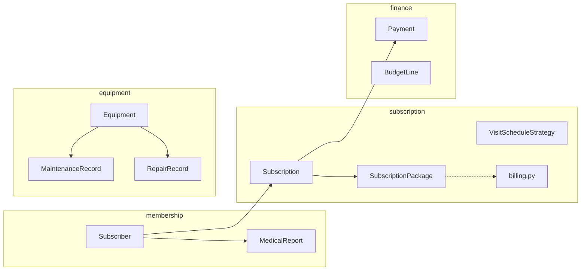

# Spor Salonu Yönetim Bilgi Sistemi — tam proje bağlamı (AI & ekip)

Bu belge, **Konu 3** kapsamındaki uygulama için **tek kaynak bağlamdır**. Başka bir LLM’e veya arkadaşınıza verirken bu dosyayı (ve gerekiyorsa `README.md`) ekleyin; **ders ödevinde istenen analiz, tasarım, UML ve izlenebilirlik** çıktılarını üretmek için yeterli bağlam burada toplanır.

**Hızlı yollar**

- Canlı API sözleşmesi: sunucu çalışırken `http://127.0.0.1:8000/openapi.json` veya `/docs`
- Web arayüzü: `http://127.0.0.1:8000/ui/`
- Kaynak kök: [`src/gym_management/`](../src/gym_management/)

---

## 1. Bu belgeyi nasıl kullanmalı (AI için)

1. **İzlenebilirlik tablosu:** Bölüm 5’teki `FR-XX` satırlarını Excel/Violet notlarına kopyalayın; sütun ekleyerek “analiz sınıfı / tasarım sınıfı / diyagram adı” doldurun.  
2. **Kullanım duumu:** Bölüm 6’daki her `UC-XX` için özet metin + diyagram türü önerisi hazırdır; Violet metin kutularına uyarlayın.  
3. **Sınıf diyagramı:** Bölüm 4 (domain), 7 (kalıplar), 8 (ORM) birleştirilerek Violet’te paketlenir.  
4. **Tasarım sınıf diyagramı:** Domain sınıflarına repository arabirimleri, `*Repository` adapter’ları, API şemaları ve (isteğe bağlı) route→use-case notları eklenir.  
5. **Sequence / Activity / State:** Bölüm 9–11’de hangi senaryoya hangi diyagramın oturduğu yazılıdır; mesaj sırasını route + repo dosya adlarından çıkarın.  
6. **Kabul ve kısıtlar:** Bölüm 12 rapordaki “varsayımlar” bölümüne doğrudan taşınabilir.

---

## 2. Proje kimliği ve teknoloji

| Özellik | Değer |
|---------|--------|
| Konu | **Konu 3 — Spor Salonu Yönetim Bilgi Sistemi** (Yazılım Mühendisliği proje ödevi) |
| Dil / çatı | Python 3.11+ |
| HTTP | **FastAPI** |
| Kalıcılık | **SQLite** dosyası `gym.db` (uygulama **çalıştırılan çalışma dizininde** oluşur; genelde proje kökü) |
| ORM | SQLAlchemy 2.x |
| Web UI | Jinja2 şablonları + Chart.js (CDN) gösterge panelinde |
| Paket adı | `gym_management` ([`src/gym_management`](../src/gym_management)) |

**Önemli mimari gerçek:** İş kurallarının çoğu **domain** katmanındadır. **Uygulama servisi** sınıfları ayrı dosyada yoktur; HTTP handler’lar ([`api/routes/`](../src/gym_management/api/routes/), [`web/ui_routes.py`](../src/gym_management/web/ui_routes.py)) doğrudan **repository** somut sınıflarını çağırır. Tasarım raporunda isterseniz bunları “`XYZService` (kavramsal)” olarak diyagrama ekleyebilir veya mevcut yapıyı “Application = FastAPI endpoints” diye etiketleyebilirsiniz — ikisi de öğretim bağlamında savunulabilir.

---

## 3. Ders ödevi maddeleri — kod tarafı vs rapor tarafı

Ödev metninde istenenlerden bu repoda **ne var**, **ne yok**:

| Ödev beklentisi | Bu repoda | Arkadaşlar / rapor |
|-----------------|-----------|---------------------|
| Proje planı, Gantt, fizibilite, ekip, risk | — | Rapor + Violet dışı araçlar |
| Kullanım senaryosu modeli + diyagram | Kısmen: UC kataloğu aşağıda | Metin + Violet use case |
| İzlenebilirlik tablosu (sınıf düzeyi) | Kısmen: `FR-XX` tabanlı | Tabloyu tamamlayıp teslim |
| Analiz (alan) sınıf diyagramı | Sınıf listesi + ilişkiler metinde | Violet’te çizim |
| Tasarım sınıf diyagramı (+ metotlar) | Kod metotları = tasarım | Diyagramda gösterme |
| ≥1 sequence, ≥1 activity, ≥1 state | Senaryo önerileri §9–11 | Violet’te çizim |
| ≥1 modül kod + istenirse platform | Tüm backend + web UI | — |
| ≥2 birim testi + çıktı + tasarımcı bilgisi | `tests/` içinde 12+ test (tıbbi rapor, ziyaret stratejisi, faturalama dönemi, bütçe–ödeme) | Rapor ekran görüntüsü, öğrenci adı |
| Varsayımlar açık | §12 | Rapora aktar |

---

## 4. Kavramsal modüller (UML paket kutuları için)

Aynı isimlerle `domain/` altında klasör yapısı vardır:



---

## 5. İzlenebilirlik tablosu (fonksiyonel gereksinim → kod)

**FR kimlikleri** raporda sabit kullanın; tabloyu genişletin.

| ID | Gereksinim (özet) | Domain sınıfları | Repository / adapter | REST (JSON) | Web UI |
|----|-------------------|------------------|----------------------|-------------|--------|
| FR-01 | Çoklu paket tipleri (2 gün / 3 gün / günlük saat penceresi), fiyat; **faturalama dönemi** (aylık / 3–6–12 ay) `billing_cycle_months` | `SubscriptionPackage`, `PackageKind`, `VisitScheduleStrategy`, `package_factory`, [`billing.py`](../src/gym_management/domain/subscription/billing.py) | `SqlSubscriptionPackageRepository` | `POST/GET /subscriptions/packages` | `/ui/packages` |
| FR-02 | Abonelik başlatma | `Subscription`, `SubscriptionStatus` | `SqlSubscriptionRepository` | `POST /subscriptions/memberships`, `GET .../by-subscriber/{id}` | `/ui/subscriptions` |
| FR-03 | Ödeme takibi; **ödeme, ödenen ayın abonelik geliri bütçesine işlenir** | `Payment` | `SqlPaymentRepository`; `SqlBudgetLineRepository.apply_subscription_payment_to_budget` | `POST/GET .../payments`, `GET .../total` | `/ui/subscriptions` (ödeme) |
| FR-04 | Bütçe planlama (plan vs gerçekleşen) | `BudgetLine`, `BudgetCategory` | `SqlBudgetLineRepository` | `PUT/GET /subscriptions/budget/{y}/{m}` | `/ui/budget` |
| FR-05 | Abone bilgisi saklama | `Subscriber` | `SqlSubscriberRepository` | `POST/GET /membership/subscribers` | `/ui/members` (paket sütununda **yalnızca aktif** abonelikler) |
| FR-06 | Spor yapabilir raporu; 1 yıl geçerlilik; sorgu | `MedicalReport` | `SqlMedicalReportRepository` | `POST /membership/medical-reports`, `GET .../expiring` | `/ui/members`, `members#raporlar`; panelde bitişi **bugün…+30 gün** aralığında olanlar (**süresi geçmişler hariç**) |
| FR-07 | Salon içi bakım + maliyet | `MaintenanceRecord` | `SqlMaintenanceRepository` | `POST/GET /equipment/{id}/maintenance` | `/ui/equipment` (kompakt satırlar, kayıt/formlar `<details>`) |
| FR-08 | Dış serviste tamir + maliyet | `RepairRecord` | `SqlRepairRepository` | `POST/GET /equipment/{id}/repairs` | `/ui/equipment` |
| FR-09 | Dönemsel maliyet özeti (bakım vs tamir) | — (toplama) | `SqlMaintenanceRepository.total_cost_between`, `SqlRepairRepository.total_cost_between` | `GET /reports/costs` | `/ui/reports` |
| FR-10 | Gösterge paneli (istatistik + grafik) | — | Çoklu repo çağrıları | — | `/ui/` (Chart.js) |

**Otomatik test eşlemesi (domain):**

| ID | Test dosyası / fonksiyon |
|----|--------------------------|
| T-01 | [`tests/test_medical_report.py`](../tests/test_medical_report.py) — `MedicalReport` süresi, artık yıl |
| T-02 | [`tests/test_visit_schedule_strategy.py`](../tests/test_visit_schedule_strategy.py) — paket kuralları, strateji validasyonu |
| T-03 | [`tests/test_subscription_billing.py`](../tests/test_subscription_billing.py) — `billing_cycle_months` ile dönem sayısı ve beklenen tutar |
| T-04 | [`tests/test_budget_payment_sync.py`](../tests/test_budget_payment_sync.py) — ödeme sonrası bütçe `actual` güncellemesi |

---

## 6. Aktörler ve kullanım senaryosu kataloğu (metin taslağı)

**Aktörler (öneri):** `Yönetici` (veya `Personel`), `Sistem`, isteğe bağlı `Üye` (şu an kodda üye girişi yok; UC’de “personel adına” varsayabilirsiniz).

| UC ID | Ad | Aktör | Ana hedef |
|-------|-----|-------|-----------|
| UC-01 | Paket tanımla | Yönetici | Yeni üyelik paketi ve fiyat oluştur |
| UC-02 | Üye kaydet | Yönetici | Abone ve isteğe bağlı rapor bağlantısı |
| UC-03 | Sağlık raporu kaydet | Yönetici | Spor uygunluk belgesi ve tarih |
| UC-04 | Rapor süresi sorgula | Yönetici | Süresi dolan / yakında dolacak raporları listele |
| UC-05 | Abonelik başlat | Yönetici | Üye + paket ile abonelik |
| UC-06 | Ödeme kaydet | Yönetici | Aboneliğe tahsilat |
| UC-07 | Bütçe güncelle | Yönetici | Aylık plan/gerçekleşen |
| UC-08 | Ekipman kaydet | Yönetici | Envanter |
| UC-09 | Bakım kaydet | Yönetici | Salon bakımı + maliyet |
| UC-10 | Tamir kaydet | Yönetici | Dış servis + maliyet |
| UC-11 | Maliyet raporu görüntüle | Yönetici | Tarih aralığında bakım/tamir toplamları |

Her UC için raporda tipik olarak: **önkoşullar**, **ana akış** (numaralı adımlar), **alternatif / istisna** (ör. geçersiz tutar), **sonkoşullar** yazılır. API/UI yolları için §5’e bakın.

---

## 7. Tasarım kalıpları (UML notasyonu için)

| Kalıp | Tasarım amacı | Kod konumu |
|-------|---------------|------------|
| **Strategy** | Paket tipine göre “o gün/saatte gelinir mi?” kuralını değiştirilebilir yapmak | [`schedule_strategy.py`](../src/gym_management/domain/subscription/schedule_strategy.py) (`VisitScheduleStrategy`, `FixedWeekdaysStrategy`, `DailyTimeWindowStrategy`) |
| **Factory** | Paket + stratejiyi kurallarıyla birlikte oluşturmak | [`package_factory.py`](../src/gym_management/domain/subscription/package_factory.py) |
| **Repository** | Domain’i veritabanından ayırmak | [`repositories.py`](../src/gym_management/application/repositories.py) (Protocol), [`repo_sqlalchemy.py`](../src/gym_management/infrastructure/repo_sqlalchemy.py) (uygulama) |

**Saf yardımcılar:** Tahsilat özeti için ay bazlı dönem sayımı [`billing.py`](../src/gym_management/domain/subscription/billing.py) (`subscription_billing_period_count`, `subscription_expected_total`).

İsteğe bağlı rapor notu: Adapter somut sınıflar `Sql*Repository` ile “Infrastructure” paketinde gösterilir.

---

## 8. Domain sınıfları — alanlar ve davranış

### `membership/`

- **`MedicalReport`**: `institution_name`, `issued_on`; `expires_on()`, `is_expired(as_of)`, `days_until_expiry(as_of)` — **1 yıl kuralı** burada.
- **`Subscriber`**: `full_name`, `email`, `phone`, `medical_report_id` (opsiyonel FK).

### `subscription/`

- **`PackageKind`**: `fixed_two_days` | `fixed_three_days` | `daily_time_window`.
- **`SubscriptionPackage`**: fiyat (`price_amount`) **faturalama dönemi başına** tutar; `billing_cycle_months` (ör. 1 = aylık, 3 = üç aylık, 12 = yıllık); `kind`, `allowed_weekdays`, saat penceresi; `allows_visit(weekday, time)` → stratejiye delege.
- **`Subscription`**: `subscriber_id`, `package_id`, `start_date`, `end_date`, `status` (`SubscriptionStatus`).

### `finance/`

- **`Payment`**: `subscription_id`, `amount`, `paid_at`, `note`.
- **`BudgetLine`**: `period_year`, `period_month`, `category`, `planned_amount`, `actual_amount`.
- **`BudgetCategory`**: `subscription_revenue`, `maintenance_expense`, `repair_expense`.

### `equipment/`

- **`Equipment`**: `name`, `serial_number`, `status` (`EquipmentStatus`).
- **`MaintenanceRecord`**: salon bakımı — `equipment_id`, `performed_on`, `cost_amount`, `description`.
- **`RepairRecord`**: dış tamir — `equipment_id`, `service_vendor`, `sent_on`, `returned_on`, `cost_amount`, `description`.

### Hafta günü kodu

**Hafta günü:** `datetime.weekday()` ile **0 = Pazartesi … 6 = Pazar** (sabit paket günleri bu kodlamayla saklanır).

---

## 9. Sequence diyagramı için örnek mesaj zincirleri

Örnek: **UC-06 Ödeme kaydet (REST)**

1. `Client` → `FastAPI` : `POST /subscriptions/memberships/{id}/payments`
2. `Route handler` → `SqlSubscriptionRepository` : `get(subscription_id)` (doğrulama)
3. `Route handler` → `SqlPaymentRepository` : `add(Payment)`
4. `SqlPaymentRepository` → `Session` : flush / commit (`get_db` dependency)

Örnek: **UC-05 Abonelik (Web)**

1. `Browser` → `GET /ui/subscriptions`
2. `ui_routes.page_subscriptions` → çoklu `Sql*Repository.list...`
3. `render_page` → Jinja şablonu

Violet’te yaşam çizgisi: `Actor`, `Route`, `Repository`, `Database` (isteğe bağlı).

---

## 10. Activity diyagramı için iyi adaylar

- **Yeni abonelik + ilk ödeme:** Üye var mı? Paket seçimi → abonelik oluştur → (isteğe bağlı) ödeme.  
- **Ekipman tamir süreci:** Arıza → servise gönder → (isteğe bağlı) iade → maliyet kaydı.  
- **Rapor yenileme uyarısı:** Rapor bitiş tarihi kontrol → liste / bildirim (raporda metinsel).

---

## 11. State (durum) diyagramı için iyi adaylar

| Varlık | Durumlar (koddaki enum / mantık) | Not |
|--------|-----------------------------------|-----|
| `Subscription` | `active`, `expired`, `cancelled` | `SubscriptionStatus` |
| `Equipment` | `operational`, `maintenance`, `out_for_repair` | `EquipmentStatus` |
| `MedicalReport` (soyut) | `valid` / `expired` | Tarih ile türetilir; ayrı enum yok |

Ödev “en az bir state şeması” istiyorsa **`Equipment`** veya **`Subscription`** en doğrudan eşleşmedir.

---

## 12. Varsayımlar ve kısıtlar (rapor “kabul ve kısıtlar”)

1. **Tek şube**; çoklu lokasyon/tenant yok.  
2. **TRY** tek para birimi; kur, vergi, fatura detayı yok.  
3. **Kimlik doğrulama / rol** yok; tüm API/UI aynı güvenilir kullanıcı varsayımı.  
4. Paketler **önceden tanımlı** şablonlardır; üye başına dinamik gün seçimi yok.  
5. Tıbbi rapor: **veriliş + 1 takvim yılı** biter; 29 Şubat verilişinde ertesi yıl 28 Şubat’a clamp.  
6. Veri tabanı: **yalnızca SQLite**, `gym.db` çalışma dizininde.  
7. **Seed:** Paket tablosu boşken [`seed.py`](../src/gym_management/infrastructure/seed.py) örnek veri yükler (üyeler, aylık/çok aylık paketler, ödemeler, ekipman, bütçe). Şema sütunu eklendiyse (`billing_cycle_months` vb.) genelde **`gym.db` silinip** uygulama yeniden başlatılır (dosya kilitliyse sunucuyu durdurun).  
8. Gösterge paneli grafikleri **Chart.js CDN** ile yüklenir (çevrimdışı sunum için CDN’siz yerelleştirme yapılabilir). **Rapor uyarı kartı** için gösterge paneli sayfasına özel tipografi (Google Fonts) yüklenebilir; ekipman sayfası benzer şekilde üretim dışı font kullanır — ikisi de CDN’ye bağlıdır.  
9. E-posta / isim olarak **`@demo.test` kullanılmaz**; tohum veride örnek alan adları (`sportifposta.com`, `posta.gen.tr`) tercih edilir.

---

## 13. Kalıcılık (tablolar) — özet

| Tablo | Ana alanlar / not |
|-------|-------------------|
| `medical_reports` | `institution_name`, `issued_on` |
| `subscribers` | `email` unique, `medical_report_id` FK |
| `subscription_packages` | `kind`, `allowed_weekdays_json`, `window_start/end`, `price`, **`billing_cycle_months`** (varsayılan 1) |
| `subscriptions` | `subscriber_id`, `package_id`, `start_date`, `end_date`, `status` |
| `payments` | `subscription_id`, `amount`, `paid_at` |
| `budget_lines` | unique `(period_year, period_month, category)` |
| `equipment` | `status` |
| `maintenance_records` | `equipment_id`, `performed_on`, `cost` |
| `repair_records` | `equipment_id`, `service_vendor`, `sent_on`, `returned_on`, `cost` |

---

## 14. REST ve web rotaları (kısa indeks)

**REST:** [`api/routes/membership.py`](../src/gym_management/api/routes/membership.py), [`subscriptions.py`](../src/gym_management/api/routes/subscriptions.py), [`equipment.py`](../src/gym_management/api/routes/equipment.py), [`reports.py`](../src/gym_management/api/routes/reports.py)

**DTO’lar:** [`api/schemas.py`](../src/gym_management/api/schemas.py)

**Web:** [`web/ui_routes.py`](../src/gym_management/web/ui_routes.py), şablonlar [`web/templates/`](../src/gym_management/web/templates/), stil [`web/static/styles.css`](../src/gym_management/web/static/styles.css).

- **Gösterge paneli (`/ui/`):** Chart.js (CDN) ile son 6 ay ödeme trendi, aylık bütçe plan/gerçekleşen, ekipman durum dağılımı; yaklaşan sağlık raporu bitişleri (30 gün penceresi, gün sayacı); kısayol şeridi (`/ui/members`, paketler, rapor arşivi).  
- **Ekipman:** kompakt envanter satırları, yapışkan ID paneli, form ve geçmiş kayıtlar genişletilebilir blokta.  
- **Paketler:** faturalama dönemi seçimi; fiyat = seçilen dönem başına tutar.  
- **Üyeler:** paket bilgisi yalnızca **aktif** aboneliklerden.

**Uygulama girişi:** [`main.py`](../src/gym_management/main.py)

---

## 15. Birim testleri (rapor için)

- Çalıştırma: proje kökünde `pytest -v` veya `pytest -q`  
- Dosyalar: [`tests/test_medical_report.py`](../tests/test_medical_report.py), [`tests/test_visit_schedule_strategy.py`](../tests/test_visit_schedule_strategy.py), [`tests/test_subscription_billing.py`](../tests/test_subscription_billing.py), [`tests/test_budget_payment_sync.py`](../tests/test_budget_payment_sync.py) (toplam 12+ test fonksiyonu)  
- İçindeki **“Designed by:”** yorumlarını teslimden önce gerçek öğrenci bilgisiyle doldurun.  
- Rapor: kaynak kodu + **başarılı pytest çıktısı ekran görüntüsü**.

---

## 16. Arkadaşların hâlâ üretmesi gerekenler (özet kontrol listesi)

- [ ] Proje planı (alan, kabul/kısıt, Gantt, fizibilite, ekip şeması, risk tablosu)  
- [ ] Use case diyagramı + senaryo metinleri (§6’dan üretin)  
- [ ] İzlenebilirlik tablosu (§5 `FR-XX` ile genişletilmiş)  
- [ ] **Analiz** sınıf diyagramı (alan modeli)  
- [ ] **Tasarım** sınıf diyagramı (metotlar + katman/paket)  
- [ ] En az **birer** sequence, activity, state (§9–11)  
- [ ] Violet 0.21.1 veya öğretim kurallarına uygun araç  
- [ ] Birim test raporu bölümü (kim, ne tasarladı, çıktı)

---

## 17. Başka bir AI’ye yapıştırılabilecek kısa talimat (prompt parçası)

Aşağıdaki bloğu olduğu gibi kullanabilirsiniz:

```text
Bağlam: docs/MODEL_REFERENCE.md dosyası bir “Spor Salonu Yönetim Bilgi Sistemi” (Konu 3) Python/FastAPI/SQLite projesini anlatıyor.
Görev: Türkçe yazılım mühendisliği proje ödevi için (1) use case diyagramı metinleri ve izlenebilirlik tablosu, (2) analiz ve tasarım sınıf diyagramları (Violet uyumlu paket isimleri), (3) seçilen ana senaryo için birer sequence / activity / state diyagramı taslağı üret.
Kısıtlar: Kodda olmayan büyük yeni özellik ekleme; varsayımları MODEL_REFERENCE §12 ile uyumlu tut.
FR-XX ve UC-XX kimliklerini referans al.
```

---

*Belge sürümü: uygulama kod tabanı ile senkron tutulmalı; önemli mimari değişikliklerde §5 ve §8 güncellenir.*
